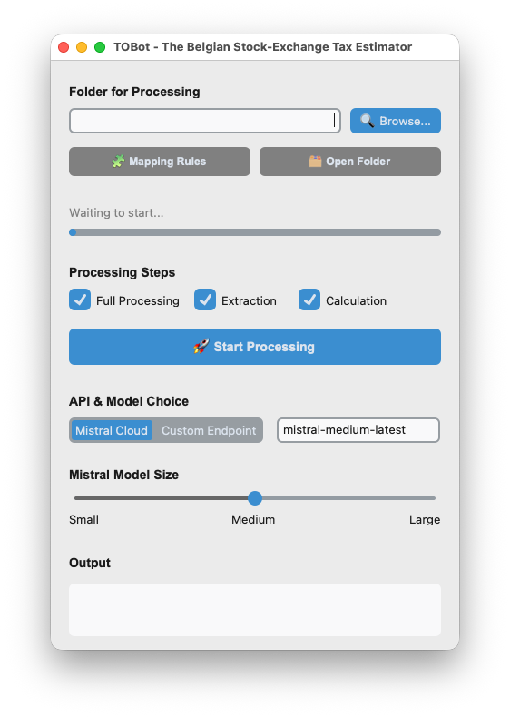

# TOBot - The Belgian Stock-Exchange Tax Toolbox

TOBot is an automated tool designed to help Belgian retail investors calculate the Tax on Stock Exchange Transactions (TOB). By directly ingesting human-readable PDF brokerage statements, extracting valid trades, and calculating the final tax owed (including foreign exchange conversions), TOBot assists in bridging the gap between the wide variety of broker reports and Belgium's complex tax rules.

## 🚀 Quick Start

Before running the application, ensure you have Python installed and install the required dependencies (e.g., `pip install -r requirements.txt` ideally using uv in your virtual environment). 

**Important:** To use the Mistral cloud extraction engine it relies on, you must [obtain a free Mistral API key](https://docs.mistral.ai/getting-started/quickstarts/studio/activate-and-generate-api-key) from their Developer Console and provide its value either via MISTRAL_API_KEY environment variable or by providing it the configuration file (see details below).

**Run via GUI (Recommended for beginners):**
Simply launch the application without any arguments:
```bash
python main.py
```

> **Tip:** For GUI target you can simply download and extract standalone executable [here](https://github.com/ondrejlabs/tobot/releases).

* **Choose a folder** where your statements are located (notice the app is designed for batch processing from scratch and will process all available PDF files in the folder).
* (Optionally) **Consult your Mapping Rules** file content which correct content will minimize the risk of hallucinations/incorrect matches on ambiguious input due to often incomplete input data in the broker statements.
* **Press Start Processing** (if you don't want to change any of the recommended default options).
* Follow the flow of processing in the **Output field**.




**Run via CLI:**
For users who prefer the command line, TOBot offers several flows (notice only -f option is always mandatory to avoid launching in GUI mode):

* **Standard Full Run:** Process a folder of PDFs using the largest Mistral model ("mistral-medium-latest" is the default so we have to override it explicitly here)
    ```bash
    python main.py -f "/path/to/statements" -m "mistral-large-latest"
    ```
* **Extraction Only:** Read the PDFs and generate intermediate [JSON](https://stackoverflow.blog/2022/06/02/a-beginners-guide-to-json-the-data-format-for-the-internet/) files this time using a local model via the OpenAI API. Skipping the calculation part is useful if you want to manually verify or edit the extracted trades before doing the final math.
    ```bash
    python main.py -f "/path/to/statements" -a openai -m "ministral-3:14b"
    ```
* **Calculation Only:** Skip the AI extraction and calculate the taxes based on the already generated (and potentially manually corrected) JSON files.
    ```bash
    python main.py -f "/path/to/statements" -c
    ```

---

## 🎯 Motivation

Belgian tax resident who are investing via non-compliant brokers must calculate, declare and pay the TOB (abbreviation of Taks op de beursverrichtingen or Taxe sur les opérations de bourse) themselves on monthly basis to the FOD Financiën. The calculation itself is repetitive, and the taxation rules can be delicate; therefore, the process is prone to errors. Investors are thus facing a conflict between what optimal investing strategies like: 
 * [frequent rebalancing](https://doi.org/10.1093/rapstu/raac020) and
 * [periodic cost averaging](https://doi.org/10.58886/jfi.v20i2.3353) compared with to market timing strategies,

  ...versus what is feasibly reportable and not suprisingly costly.

This process was already automated[^1] for users of ceratin brokers but the submission process changed significantly on [July 14, 2025](https://tob.tax/en/how-to-declare). Tax payers have now an online web form available at [DivTax site](https://finance.belgium.be/en/E-services/divtax) to fill out their TOB declarations for each month individually (whereas the old PDF template explicitly allowed declaring two months in one pass).

TOBot is designed to act as an AI-powered assistant to this process — especially tailored for less-technical users or investors who want the peace of mind of remaining flexible with their platform choices without worrying about whether their current broker is supported.

**The TOBot Approach** 
 * TOBot uses **LLM supported processing of PDF reports** that can contain quite some extra noise than just well structured transaction records.
 * It has been tested using **Interactive Brokers, Trading 212, and TradeStation** statements (plus cross-validated on **Trade Republic** as this one is a rare exception of non-Belgian broker providng the full reporting to Belgian tax residents).
 * It aims to **eliminate the duplicate effort of CSV exports** by reading supporting human-friendly output from brokers directly.

While this adaptive approach increases flexibility towards data from brokers or breaking changes in the statements from the known one, it comes at the possible expense of precision — users should always check the final output. Suggestions on how to improve prompts and parsing for other brokers are welcome!

---

## ✨ Key Features

* **PDF Ingestion:** Directly processes broker PDFs using multimodal AI, eliminating the need rely on a rigid CSV data structure.
* **Smart Filtering:** Automatically identifies valid buy/sell transactions while ignoring from TOB declaration point of view irrelevant portfolio holdings, dividends, and Forex conversions.
* **Tax Categorization:** Maps securities to specific TOB taxation levels (0.12%, 0.35%, 1.32%) based on asset type and fund registration.
* **Automated FX Conversion:** Automatically fetches historical exchange rates (via the Frankfurter API) to calculate values accurately in EUR.
* **Audit-Ready Summaries:** Generates structured CSVs and text summaries tailored to match what is needed for the DivTax form.
* **Dual-Interface:** The application was designed with [MVC pattern](https://en.wikipedia.org/wiki/Model%E2%80%93view%E2%80%93controller) in mind and has both a CLI (Command Line Interface) and a GUI (Graphical User Interface) so the users can choose the preferred way how to use it most effectively. 

---

## 🏗️ Architecture & Technologies

TOBot is built on a hybrid extraction pipeline designed to maximize accuracy while minimizing unnecesaroy sources of noise:

* **Multimodal Dual-Input:** 
  Processing complex financial tables visually is notoriously difficult. To combat OCR errors and LLM hallucinations, TOBot sends both the visual PDF render *and* the exact underlying text layer to the multimodal AI.
  Combined with a rigorous set of prompt guardrails, this significantly boosted both precision (how many records are correct) and recall (how complete the output is) of the tool.

* **PDF Processing Pipeline — pdfplumber, fitz, and Docling:** Extracting reliable content from PDFs requires different tools depending on what the downstream model expects. TOBot uses two complementary libraries for this.

  [pdfplumber](https://github.com/jsvine/pdfplumber) is used to extract the **text layer** — the raw, machine-readable characters embedded in the PDF — and this extracted text is injected into the prompt alongside the visual input for both the cloud and local processing paths. Because it reads the text that is already there rather than performing character recognition from pixels, it is fast, dependency-light, and highly accurate for broker statements.
  
  The **Mistral Cloud path** can offload PDF rendering entirely: the file is uploaded via the Files API and passed to the model as a signed document URL. Mistral's infrastructure handles the visual rendering server-side, so TOBot only needs to supply the file and the text layer — no local image conversion is required.

  The **Custom Endpoint (local) path** cannot rely on this: open-weight multimodal models accessed via the OpenAI-compatible API expect image files, not document URLs. [PyMuPDF](https://pymupdf.readthedocs.io/) (`fitz`) is therefore used to render each PDF page into a bitmap and encode it as a base64 PNG before sending it to the model.
  
  This introduces extra processing steps — rendering resolution, memory usage, and per-page encoding time all scale with document length — but it also gives direct control over output quality. The render matrix in `fitz` can be adjusted to increase resolution for statements with dense or small-font tables, at the cost of larger payloads and slower inference. Users running local models on memory-constrained hardware should be aware that multi-page statements can produce substantial image payloads.

  **Docling (Evaluated but Excluded for the time being):** [Docling](https://github.com/DS4SD/docling) (an ML-based markdown toolkit) was implemented and tested and remains available in the codebase as an option. However, because it introduced massive dependencies without providing a major improvement to final precision over the chosen plain-text-plus-visual approach, it was not included directly.


* **Pydantic Validation Layer:** Raw LLM output is inherently unpredictable — even a well-prompted model can occasionally return a misformatted number, omit a required field, or hallucinate a value that conflicts with other fields in the same row.

  To enforce consistency:
  TOBot wraps the API response in a simle but strict [Pydantic](https://docs.pydantic.dev/) schema (`TradeExtraction` → `Trade`). The model is instructed to return structured output conforming to this schema directly, which means malformed responses are rejected at the API boundary before they ever reach the calculation phase.

````mermaid
  classDiagram
    direction TB
    
    class TradeExtraction {
        +Optional~str~ broker
        +List~Trade~ trades
        +model_dump() dict
        +model_validate_json() TradeExtraction
    }
    
    class Trade {
        +int position
        +str date
        +Optional~str~ isin
        +Optional~str~ ticker
        +Optional~str~ security_name
        +float quantity
        +Optional~float~ price
        +Optional~float~ value
        +Optional~float~ fee
        +Optional~str~ currency
        +float tax_rate
        +Optional~str~ extra_info
        +str original_text
        +validate_and_clean_data() Trade
    }

    TradeExtraction "1" *-- "many" Trade : contains
  ````
  
  Beyond schema enforcement, a `model_validator` performs post-extraction arithmetic checks:
  If both `quantity` and `price` are present, the validator independently recalculates the expected transaction value and overwrites any extracted total that deviates significantly — catching silent OCR errors that would otherwise quietly corrupt the final tax figures.
  It also normalises edge cases like null or negative fees and emits warnings when a fee looks anomalously high relative to the transaction value (configurable via `fee_threshold` and `fee_ratio_threshold` in `config.toml`).
  
  Together, schema enforcement and field-level validation act as a deterministic safety net that significantly reduces the impact of the non-deterministic nature of LLM inference.


* **Why Mistral AI as default?** While users have an option to switch to any enpoint that supports OpenAI API, Mistral AI models accessed via their [client library](https://github.com/mistralai/client-python) were chosen for two main reasons.
  * First, as an EU-based company, they offer stronger alignment with European data security expectations.
  * Second, they are highly transparent about their [environmental standards and impact](https://mistral.ai/news/our-contribution-to-a-global-environmental-standard-for-ai) compared to other major AI providers.
  * And third, designed its models with a heavy emphasis on multilingualism from the ground up. Instead of treating non-English languages as an afterthought or a fine-tuning add-on, Mistral includes massive amounts of high-quality French, German, Spanish, Italian, and Dutch data in the initial pre-training phase. This should guarante a state of art performance when processing documents in other than English language as well.

* **Cross-Platform Desktop Application:**
  * TOBot targets retail investors across different operating systems, and the project deliberately avoids tying development effort to a single platform or runtime environment. A web application was considered but ruled out for this phase — browser-based tools introduce their own complexity around local file access, session handling, and dependency on a running server process, none of which is a natural fit for a tool that reads files from your own machine and runs potentially long AI jobs.
  
  * Instead, the GUI is built with [CustomTkinter](https://github.com/tomschimansky/customtkinter), a modern theming layer on top of Python's standard tkinter library, which renders natively on Linux, macOS, Windows without requiring platform-specific packaging or browser compatibility maintenance effort. The goal was a clean, highly portable desktop experience that behaves consistently regardless of OS, so that the limited development time could stay focused on extraction accuracy and tax logic rather than platform-specific UI differences.

---

## ⚙️ Configuration & Advanced Settings

Advanced settings and runtime behaviors are controlled via three main configuration files located in the application directory.

### 1. Global Settings (`config.toml`)
This [TOML](https://github.com/toml-lang/toml) file controls the core parameters and memory states of the application:
* **`base_url`:** The URL for a custom OpenAI compatible API endpoint (e.g., "http://localhost:11434" for a local instance hosted by Ollama).
* **`fee_ratio_threshold`:** A warning threshold (default = 0.01 or 1%) that triggers a log warning if a broker's fee is unusually high relative to the total transaction value. 
* **`fee_threshold`:** A warning threshold (default = 29) that triggers a log warning for unusually high absolute fee amounts (Default is chosen as it matches the 29 EUR currently standard maximums for tiered Interactive Brokers accounts).
* **`last_folder_path`:** Automatically saves the last directory you selected in the GUI so you don't have to navigate to it again on your next run.
* **`mapping_csv_path`:** The file path to your custom list of securities' identifiers that (as explained in more detail below) should always override the occasionally ambiguious or conflicting inputs in the broker statements (default is "mapping.csv").
* **`mistral_api_key`:** Your [authentication key](https://docs.mistral.ai/getting-started/quickstarts/studio/activate-and-generate-api-key) for accessing Mistral Cloud models. This can alternatively be set as a `MISTRAL_API_KEY` environment variable — however, if a value is present in both places, the `config.toml` entry takes precedence and a warning will be logged to alert you to the conflict.
* **`mistral_interval_sec`:** A delay (default 30 seconds) injected before each response request. This helps preventing one of the typical rate limits of the free plan (max. 2 requests per minute).
* **`model_choice`:** The Mistral AI model to be used (e.g., `"mistral-large-latest"`). This value is only saved automatically when closing the application while **Mistral Cloud** is selected — if you close the app with **Custom Endpoint** active, the local model name is intentionally not written back to `config.toml`. This is because local model names tend to be more volatile (they depend on what you have pulled in Ollama or your equivalent runtime) and preserving them as a default could cause a confusing startup state if that model is later removed or renamed. When you switch back to Custom Endpoint in a future session, the app will query your local runtime for available models and populate the dropdown fresh.

### 2. Custom Mapping (`mapping.csv`)
If the underlying LLM misses some of the key identifiers in the input data (ISIN / name / currency) risk rises that it hallucinates the missing values and/or categorizes a specific asset correctly. You can put overrides into this file so TOBot will force the application of the correct identifiers and taxation rules on future runs.

**Example Structure:**

| isin | ticker | security_name | currency | tax_rate |
| ---- | ------ | ------------- | -------- | -------- |
| LU2009202107 | EMXN | Amundi MSCI Emerging Ex China UCITS ETF Acc | GBP | 0.0012 |
| US0846707026 | BRK-B | Berkshire Hathaway Inc | USD | 0.0035 |
| IE00BFMXXD54 | VUAA | Vanguard S&P 500 UCITS ETF Accumulating | EUR | 0.0132 |


*Note on the examples:* The Belgian TOB rules can be highly specific. In the example content above, even the GBP denominated variant of the EMXN fund at the top of the list (from a French provider) is compliant with the lowest 0.12% tax rate. In contrast, the VUAA fund at the bottom (from an American provider) is taxed with 11x higher rate (1.32%) because it is registered in Belgium.

### 3. Prompt Tuning (`prompt.txt`)
For power users, TOBot exposes the core AI instructions via the "prompt.txt" file. This allows you to engineer and fine-tune the LLM extraction logic to better handle obscure broker layouts, specific language nuances, or complex table structures.

**⚠️  WARNING:** While you have a high degree of flexibility to alter the text extraction rules, you **should strictly respect the expected JSON output schema**. Altering the required data structure (like changing key names or deleting mandatory fields) could cause the application to misbehave or even crash during the calculation phase.

### Privacy & Data Training
Mistral Cloud is the default and recommended cloud engine thanks to its transparency and compliance with European [data privacy rules](https://legal.mistral.ai/terms/privacy-policy). However, users concerned about the privacy of their financial data are advised to explicitly [opt out](https://help.mistral.ai/en/articles/455207-can-i-opt-out-of-my-input-or-output-data-being-used-for-training) of their data being used for model training.

## 📄 Output Files

After a successful run, TOBot writes the following files directly into the working folder:

| File | Generated by | Description |
|------|-------------|-------------|
| `<original_pdf_filename>.json` | Extraction phase | One file per input PDF, containing the raw structured trades as extracted by the AI. Can be manually reviewed and corrected before re-running the calculation phase. |
| `transactions_YYYY-MM.csv` | Calculation phase | A consolidated flat table of all transactions across all processed PDFs, enriched with FX rates and calculated tax amounts. |
| `tob_summary_YYYY-MM.txt` | Calculation phase | A human-readable summary grouped by tax rate, intended to be used as a reference when filling in the DivTax web form. |

The `YYYY-MM` suffix in the filenames reflects the most frequent transaction month detected across all processed files. If your statement spans multiple months, a warning is logged and the dominant month is used — in that case you may want to split your PDFs by month before processing.

> **Tip:** If you spot an error in the extracted trades, correct the relevant `.json` file and re-run using the **Calculation Only** mode (or the `-c` CLI flag) to avoid repeating the potentially costly AI extraction step.

## 🧪 Testing & Validation

### Methodology

Testing an AI-powered extraction pipeline differs fundamentally from training a traditional machine learning model. In supervised ML, the training set must be large — the model has no prior knowledge and needs thousands of labelled examples to learn statistical patterns from scratch. Prompt engineering works differently: the underlying model already possesses broad financial and linguistic knowledge from pre-training. The prompt does not teach it what a trade is; it tells a capable generalist exactly what to look for, what to ignore, and how to format its output for this specific context. As a result, **prompt development can be done effectively on a small, carefully chosen set of examples** — a handful of representative statements per broker type, covering typical layouts and known edge cases — while the large held-out test set is reserved entirely for final validation. This is closer to the way a software specification is written and then verified than to the way a neural network is trained.

Initial prompt tuning and the accompanying Python post-processing logic (field normalisation, Pydantic validation, mapping overrides) were developed against a small candidate set drawn from each supported broker format. Once the pipeline was considered stable, a final validation run was performed across **several hundred real transaction records**, with results assessed against a manually verified ground truth.

### Stability, Precision & Recall

Because TOBot is used as an input to a statutory tax declaration, the accuracy bar is set at or very close to 100% — a 10% error rate that might be acceptable in a recommendation system is not acceptable when the output feeds a legal filing. Results were therefore evaluated on following axes:

- **Coefficient of Variation (CV)** - for the total extracted value (that needs to be taxed) we calculate standard deviation of the results divided by the mean absolute value to check stability of the results.
- **Precision** — of the records TOBot extracted, what fraction were correct? (Simple tresholding of +/- 0.01 EUR difference vs. the reference for each record)
- **Recall** — of the total records present in the reference (and manually validated) set, what fraction did TOBot successfully capture?

Averaged results split by models:
| Model | CV | Recall | Precision | Response time | Notes
| :--- | :--- | :--- | :--- | :--- | :--- |
| `mistral-large-latest` | ~0% | 100% | 100% | 40 sec | Reference |
| `mistral-medium-latest` | ~0% | 100% | 100% | 35 sec |Default (still complete recall and perfect accuracy on testing set) |
| `mistral-small-latest` | 0.11% | 98.78% | 99.51% | 25 sec | Fastest online option |
| `ministral-3b:14b` (via Ollama) | 3.79% | 96.83% | 97.31% | 3 min and 30 sec | Local model, usable with careful manual review |

Results above were obtained with a correctly configured `mapping.csv` that resolves known ambiguous securities. Without mapping overrides, a small number of edge cases — where broker statements provide incomplete identifiers and the model must infer the remainder — can produce inconsistent results across runs even for the larger models, as the model may resolve the ambiguity differently each time depending on the context.


For machines that cannot run larger local models or users who don't want to wait too long for (potentially less precise) results, **cloud models remain the recommended default**. As more capable open-weight multimodal models become available and accessible on consumer hardware (or more disturbing usage limits on cloud based models) this recommendation could be revisited.

### Test Data

All validation was performed on real brokerage statements. Test records have not been published in this repository for privacy reasons. If you would like to contribute anonymised statements from brokers not yet covered, please open an issue.


---

## ⚠️ Limitations & Known Issues

* **Model Accuracy:** TOBot was found to be highly reliable (no significant drifts in results that would affect the tax amount) when using the *mistral-large* or *mistral-medium* models. Smaller Mistral models (or local counterparts) tend to introduce extra noise in single percentage of cases. Always verify the results against your original statements. If you spot an error, often you could simply correct the intermediate JSON file (or mapping file) and re-run the Calculation Only step. If you suspect the error is preventable in the code, prompt or in the default configuration, [log a bug](https://docs.github.com/en/issues/tracking-your-work-with-issues/using-issues/creating-an-issue) or suggestion for sure.
* **Local Models (Experimental):** Open-weight models like [Ministral 3 14B](https://docs.mistral.ai/models/model-cards/ministral-3-14b-25-12) were tested using a local Ollama instance on a baseline M4 Mac Mini with 16 GB of RAM. The precision was not too far behind "mistral-small" model. Using similarly or [more performant models](https://docs.mistral.ai/models/model-cards/mistral-small-4-0-26-03) on compatible hardware should bring close to perfect processing precision even when running on self-hosted, 100% private endpoints.

   Notes:
    * Cloud processing is currently orders of magnitude faster than running the same task using even Apple's recent silicon.
    * You are strongly recommended to **increase the context length** value (e.g. in Ollama's Settings from the default 4K to at least 16K), or the model will fail to interpret the prompt correctly.
    * Make sure you have enough of free operating memory when running locally as risks include system overloads, crashes and excessive wear of your SSD due to potentially resulting massive amount of memory swapping.
* **Dynamic Legislation & Liability:** Belgian tax legislation is a moving target. TOBot maps tax rates based on generic rules, but ambiguous cases require active user support (via `mapping.csv`) to guarantee deterministic and expected results. Furthermore, the official list of registered funds frequently can potentially change (refer to the FSMA official lists in [Dutch](https://www.fsma.be/sites/default/files/media/files/replacement_files/official_lists_fo_NL.xlsx) or [French](https://www.fsma.be/sites/default/files/media/files/replacement_files/official_lists_fo_FR.xlsx)). 

  ⚠️ **Disclaimer:** The author does not guarantee the accuracy of the results, even when using the best AI techniques, and assumes absolutely **no responsibility or liability** for incorrect calculations or tax filings.

---

## 🚀 Future Steps & Features

* **Continuous Testing & Model Validation:** As tax rules evolve and new alternative models are released, TOBot will require  to guarantee that both precision and processing speeds remain optimal. User input and community suggestions will be vital in polishing the features, refining the prompts and calculation logic.
* **Capital Gains Tax Integration:** On April 3, 2026, Belgium approved a [new capital gains tax](https://curvo.eu/article/belgium-capital-gains-tax) into law. TOBot's consolidated output of transaction lists — combined with an initial snapshot of holdings — positions it perfectly to be expanded in the future to help calculate these new obligations.

Footnotes:

[^1]: To automate this process for a strictly limited number of brokers a tool called [Tobcalc](https://github.com/samjmck/tobcalc) already exists. It is a web app focused on the traditional way of filing TOBs, relying on broker-specific CSV exports and filling a final PDF that used to be attached to mail 